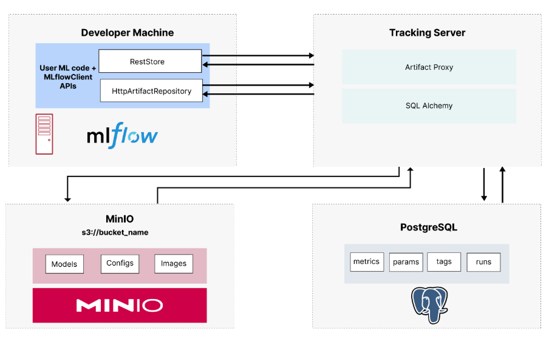

# Centralized MLflow Service
This repo provides a setup for deploying a centralized MLflow Tracking Server. The MLflow Tracking Server is a tool for managing machine learning experiments, enabling collaboration, and centralizing experiment tracking for teams.

# Features
- Centralized Experiment Tracking: Log and query experiments, runs, and metrics in a shared environment.
- Artifact Management: Store and retrieve artifacts in an S3-compatible storage.
- Backend Storage: Use PostgreSQL to store experiment metadata.
- Authentication: Basic authentication is enabled to restrict access to authorized users.

# Architecture:


# Setup Instructions
1. Prerequisites
- Docker and Docker Compose installed on your machine.
- Set up access credentials for MinIO via its UI and create a bucket named *mlflow*. Follow the steps described in [this article](https://blog.min.io/setting-up-a-development-machine-with-mlflow-and-minio/) for detailed instructions.
2. Start the Services
Run the following command to start the MLflow server, PostgreSQL, and MinIO
```bash
docker-compose up -d
```

## Requirements
1. Users can upload model artifacts to mlflow
1. Users can utilize mlflow for experiment tracking
1. Multiple teams can share the same mlflow service for managing the ML lifecycle
1. Users need to be authenticated to view any resources from the server
